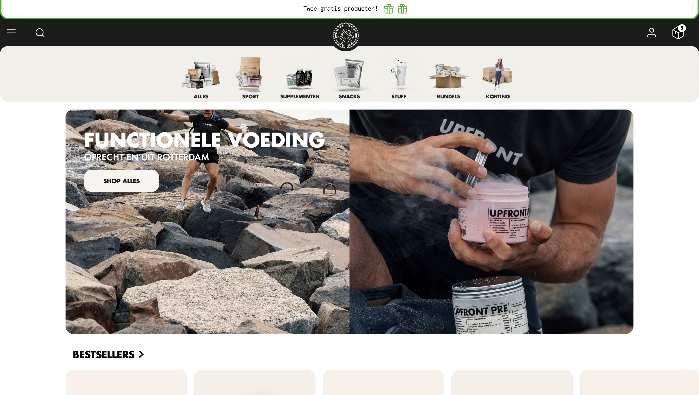
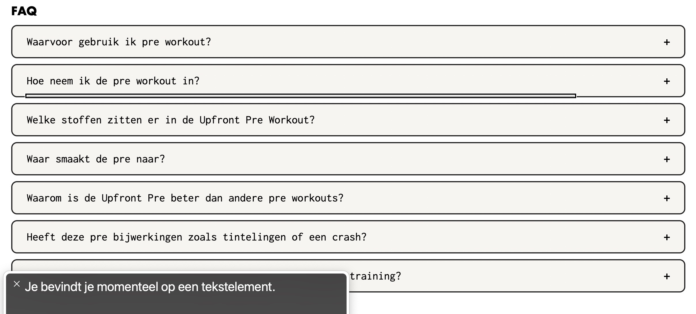

# Procesverslag
Markdown is een simpele manier om HTML te schrijven.  
Markdown cheat cheet: [Hulp bij het schrijven van Markdown](https://github.com/adam-p/markdown-here/wiki/Markdown-Cheatsheet).

Nb. De standaardstructuur en de spartaanse opmaak van de README.md zijn helemaal prima. Het gaat om de inhoud van je procesverslag. Besteedt de tijd voor pracht en praal aan je website.

Nb. Door *open* toe te voegen aan een *details* element kun je deze standaard open zetten. Fijn om dat steeds voor de relevante stuk(ken) te doen.

## Jij

  
uitwerken voor kick-off werkgroep

  ### Auteur:
Lichelle de Lange 

  #### Je startniveau:
 Blauw ! 
 Je vindt code lastig. Je oefent buiten de vakken niet vaak. 
 Met hulp lukt het meestal wel.

  #### Je focus:
 Responsive.
 Ik wil ook kijken of het mij lukt om surface toe te passen op mijn website voor een srp punt. 
 

## Je website

  
uitwerken voor kick-off werkgroep

  ### Je opdracht:
  https://upfront.nl

  Ik heb gekozen voor een website van Upfront, een website waar ik veel mee heb omdat ik naar de podcast van deze jongens luister en volledig achter hun missie en visie sta. Een website waar ik enthousiast over ben zal mij moeten helpen door dit vak heen te komen. Deze website lijkt redelijke makkelijk om na te maken. 
  . 

  #### Screenshot(s) van de eerste pagina (small screen): 
  Upfront desktop  
  

  Upfront smallscreen
 

  #### Screenshot(s) van de tweede pagina (small screen):
  Detail pagina Pre-workout Desktop
  

  Detail pagina Pre-workout smallscreen
  
 

## Toegankelijkheidstest 1/2 (week 1)

  
uitwerken na test in 1e werkgroep

  ### Bevindingen
  Lijst met je bevindingen die in de test naar voren kwamen:

  #### Screenreader
Hoofdpagina 

Het logo van website word genoemd als “ongelabelde-afbeelding”. De gebruiker weer dus niet wat dit is. 

De search bar - word juist benoemt. 

De header. Je word door de screenreader 2 keer door de header meegenomen. De eerste keer slaat hij de link “inloggen” over. De tweede keer neemt hij je wel mee door deze link. 

Evenals de header word je 2 keer door het menu meegenomen. 

Kopje bestsellers: “Je bevindt je op een tekst element.” 
Maar welke tekst er staat word niet benoemd. 

Afbeeldingen eerste kop worden voorgelezen zoals in de code is geplaatst. Niet alle afbeeldingen zijn gelabeld dus de gebruiker weer niet direct waar het kopje over gaat/over welk product dit gaat. - afbeeldingen labelen. Sommige afbeeldingen zijn wel goed gelabeld, het is een mengelmoes.  
 
De producten kunnen worden beoordeeld doormiddel van sterren. Maar deze worden afbeelding genoemd ipv dat er word verteld hoe het product is beoordeeld. Je word hier 2x doorheen geleid. 
 

Wanneer een smaak (nu de vegan cacao proteïne poeder) is uitverkocht word dat niet verteld alleen weergeven doordat het font lichter is gekleurd. 
 

Er worden opties genoemd die ik niet zie. Deze afbeeldingen zijn weg.
 

Detail pagina
Ik klik op de detail pagina van de upfront creatine. Wanneer ik door de heen klik raak ik in de war. Ik hoor allemaal informatie maar ik heb geen idee waar ik op de pagina ben. Wat blijkt ik zit in mijn winkelmandje waar 1 artikel in zit. Dit word niet van te voren aangegeven. 

Ook op de detail pagina worden niet verteld met hoeveel sterren de upfront creatine word beoordeeld. Ik word alleen 2 keer door het aantal afbeeldingen geleidt. 

De pre workout heeft 4 verschillende smaken maar deze worden niet benoemd. Ook deze worden uitgesproken als ‘afbeelding’. 

De afbeeldingen op de detail pagina worden niet benoemd, je word ook niet door de afbeeldingen geleidt. 

Je kunt producten toevoegen aan je winkelmandje. 

Je word door de tekst geleidt. 

Onder aan de details vind je alle reviews. De gebruiker kan ook filteren op review. Hier word je doorheen geleidt. 

De gebruiker word meegenomen door de FAQ. Wanneer je op de kop terecht komt en naar de volgende kop toe wilt word de uitleg al gegeven. 
 

Boven de footer vind je weer de bestsellers. Hierbij het zelfde verhaal als op de home pagina. 

  #### Muis en Toetsenbord 
  Hier korte omschrijving (met indien nodig afbeeldingen)

  Hier een omschrijving van hoe het opgelost kan worden (met indien nodig afbeeldingen)

  #### Motoriek (shocks, elastiekjes)
De website is redelijk vergevingsgezind. Er is ruimte voor fouten, de website is ruim opgesteld. 
Wanneer je op de home pagina een product hebt uitgekozen en een smaak wilt uitkiezen is daar minder ruimte voor vergevingsgezindheid.  

  #### Visueel (brillen, contrast, kleurenblind, dark/light). 
Blur/gare bril - Op de website zie ik alleen kleuren en silhouetten. 
Glaucoma/rp bril- Ik heb totaal geen focus met deze bril op. Ik kan mij niet focussen op de website. 
Hemianopia bril  - De website is te zien 
Color#0779p bril - De website is te zien. zodra je kleurenblind bent kun je goed winkelen bij upfront. Er word veel gebruik gemaakt van contrast. 
Diabetic eye disease bril - website is prima te zien. 

## Breakdownschets (week 1)

Home pagina 

  
uitwerken na afloop 2e werkgroep

  ### de hele pagina homepagina : 

  

 ### de hele pagina detailpagina :
 

## Voortgang 1 (week 2)

  
uitwerken voor 1e voortgang

  ### Stand van zaken
 Ik heb mijn breakdown schetsen af en redelijk uitgebreid getekend. Ik heb voor tijdens de meeting vragen over mijn schetsen en of ik de indeling van de door mij gekozen website; Upfront juist heb ingedeeld. Over het maken van de breakdown schetsen voel ik mij wat onzeker. Ik denk dat ik nu al de mist in ga met de indeling van de website. 

  ### Agenda voor meeting
  samen met je groepje opstellen
  Nensi, Syarah, Cesar, Lindsey & Lichelle 

  | Syarah      | Nensi          | Lichelle     | Cesar        | Linsey 
  | ---         | ---            | ---          | ---          | ---
  | Css styling | Menu styling   | breakdown    | lettertype   | Niet aanwezig 
  |             |                |              |              |
  
  ### Verslag van meeting
Ik had nog geen code maar ik had vragen over mijn breakdownschetsen. We zijn gezamelijk door mijn website en de website van Syarah heen gelopen.
Ik was goed opweg, hier en daar wat aanpassingen. De rest had zijn/haar html al gemaakt, ik helaas nog niet. 

## Voortgang 2 (week 3)

  
uitwerken voor 2e voortgang

  ### Stand van zaken
  Het ging niet goed. Ik struggle ontzettend met de code. De HTML heb ik redelijk opgezet, maar het lukt niet met de css. 
  Ik heb alles verwijderd en ga opnieuw beginnen. 

  ### Agenda voor meeting
| Nensi            | Lichelle           | Syarah       | Cesar            | Linsey           |
  | ---            | ---                | ---          | ---              | ---              |
  | Menu styling   | Geen vragen        | Css Styling  | Lettertype       | Geen vragen      |
  | Filter knop    |                    |              |                  |                  |

  ### Verslag van meeting
 In vergelijking tot de rest loop ik zo ver achter. In het voortgang gesprek met mijn groepje en Jeffrey breek ik. Beetje genânt maar ik had mijn emoties niet helemaal meer in de hand op dat moment. Ik stop veel uren in dit vak en tijdens de lessen lijkt alles zo logisch maar zodra ik het zelf moet doen en achter die laptop ga zitten.

 Ik heb al zo lang niets met code gedaan dat het voor mijn gevoel volledig uit mijn geheugen is gewist. Ik had al wat eerder aan de bel moeten trekken. Ik kom er zelf niet uit. 

## Toegankelijkheidstest 2/2 (week 4)

  
uitwerken na test in 8e werkgroep

  ### Bevindingen
  Lijst met je bevindingen die in de test naar voren kwamen (geef ook aan wat er verbeterd is):

  #### Screenreader
 - Misschien je menu items hoger dan de andere links in je navigatie, zodat hij wanneer navigatie actief is hij dus die dingen opleest voor de andere items

  #### Muis en Toetsenbord 
  Hier korte omschrijving (met indien nodig afbeeldingen)

  Hier een omschrijving van hoe het opgelost kan worden (met indien nodig afbeeldingen)

  #### Motoriek (shocks, elastiekjes)
 - Website is redelijk vergevingsgezint. 

  #### Visueel (brillen, contrast, kleurenblind, dark/light). 
- Diabetic Eye Disease - de website is goed te gebruiken, wel iets vervelender maar alles is nog te lezen 
- Gele bril - alles is gewoon geel maar nog wel te gebruiken, bij veel witgebruik kan dit wel vervelend zijn
- Blur/Glare - mogelijkheid om in te kunnen zoomen is belangrijk op de website, zodat je kan inzoomen waar nodig
- Hemifield Loss - doordat alles gecentreerd is is het niet moeilijk om met deze ziekte de website te gebruiken. 
- Central field loss - Hierdoor heb je weinig zicht in het midden. Belangrijk bij deze bril is dat je niet alles centraal in het midden zet. 
- Low contrast - Lastig om kleuren te lezen die niet veel contrast hebben. Misschien is dark mode hiervoor de oplossing. 
- Glaucoom - Belangrijke content centreren

Test kleurenblindheid
- Blurred vision - Te dunne tekst valt weg 
- Protanopia, Deuteranopia en Tritanopia- bepaalde kleuren worden geel/rood, hij is niet vervelend zo de website
- Achromatopia - zwart wit, doordat er weinig kleur gebruikt word is het niet zo heel lastig

## Voortgang 3 (week 4)

  
uitwerken voor 3e voortgang

  ### Stand van zaken
  Het gaat stukken beter. Ik ben er nog niet maar er beginnen wat kwartjes te vallen. 
  Met dank aan Jeffrey die de tijd heeft genomen om wekelijks met mij te zitten en te kijken naar mijn code. Ik ben al ver met de eerste pagina en ben begonnen aan mijn 2e pagina. Waar ik over wil vragen of er dingen uitgehaald kunnen worden. Ik heb mijn website onderschat, ik dacht dat deze iets simpeler zou zijn als dat deze eigenlijk is. 

  De basis css dingen lukken we inmiddels wel, al ben ik hier wel lang mee bezig. Ik zoek veel op. 

  ### Agenda voor meeting
  samen met je groepje opstellen

- Ik wil graag bespreken of ik mijn detailpagina wat kan indunnen of een andere pagina mag namaken omdat ik de detail pagina nogal complex vindt. 
- Ook wil ik het hebben over mijn menu, waar plaats ik de inhoud van mijn navigatie in mijn html?  

  | Nensi                 | Lichelle                   | Syarah            | Cesar                    |
  | ---                   | ---                        | ---               | ---                      |
  | Scrollen op homepage  | Side menu en detail pagina | CSS styling menu  | HTML en dropdown list    |
  |                       |                            | detail pagina     |                          |

  ### Verslag van meeting
Ik was pas als laatste aan de beurt. Ik had een vraag over mijn hambuger-menu en over een dropdown.  

https://codepen.io/shooft/pen/GRGgeKx

Ik denk dat ik met de codepen een stuk verder kom.

## Eindgesprek (week 5)

  
uitwerken voor eindgesprek

  Ik moet mijn readme nog beter bijwerken. 

  ### Je uitkomst - karakteristiek screenshots:
  

  ### Dit ging goed/Heb ik geleerd: 
  Ik vind dit vak ontzettend lastig en ik heb het dan ook niet afgekregen. Mede doordat ik op het begin vast liep en niet meteen 
  om hulp heb durven vragen. Tijdens de lessen begreep ik de stof en lijkt het zo logisch, totdat ik zelf achter mijn laptop ging 
  zitten en het maar moest uitvogelen. Na een kleine mental breakdown tijdens voortgangs gesprek 2 kon het niet zo verder gaan en heb ik wekelijks met Jeffrey gezeten. Hier heb ik ontzettend veel baat bij gehad. Ik ben helaas nog niet klaar maar ben al ontzettend blij met
  de stappen die ik heb gezet de afgelopen tijd. Ik begin dit vak zelfs een beetje leuk te vinden...
  Het gesprek van komende donderdag zal ik meenemen als feedback moment zodat ik dit vak tijdens de herkansing kan halen. 

  

  

  ### Dit was lastig/Is niet gelukt:
  Ik had mijn readme beter bij moeten houden :) Wat ik lastig vond? Alles :) Ik vind Javascript erg lastig. 
  Css vind ik nogsteeds lastig. De basic heb ik nu wel redelijk onder de knie maar de lastige dingen heb ik hulp bij gehad. 
  Zonder de hulp van Jeffrey en klasgenootjes zou ik nooit zo ver gekomen zijn. Ik heb veel van hen geleerd. 

  Waar ik voornamelijk tegen aan liep was het responsive maken van mijn website en daarbij het herindelen van de pagina - zie footer. 

  Het hamburger menu schuift open met behulp van Javascript. Dit had mij zelf niet gelukt. Ik heb hierbij ook hulp gehad. 

  Doordat ik pas later op gang ben gekomen, ben ik minder ver gekomen en is de website niet 100% afgerond. Ik had eerder aan de bel moeten trekken, dan had ik verder gekomen. Dat is een wijze les geweest. 

## Bronnenlijst

  
continu bijhouden terwijl je werkt

  Nb. Wees specifiek ('css-tricks' als bron is bijv. niet specifiek genoeg).

  1. Bron: transisition menu https://makingcss.com/transition 
  2. Jeffrey 
  3. ik heb mijn bronnen niet zo netjes bij gehouden. Ik heb veel gekeken naar css-tricks en w3-schools. 
  4. https://codepen.io/shooft/pen/GRGgeKx
  5. 

